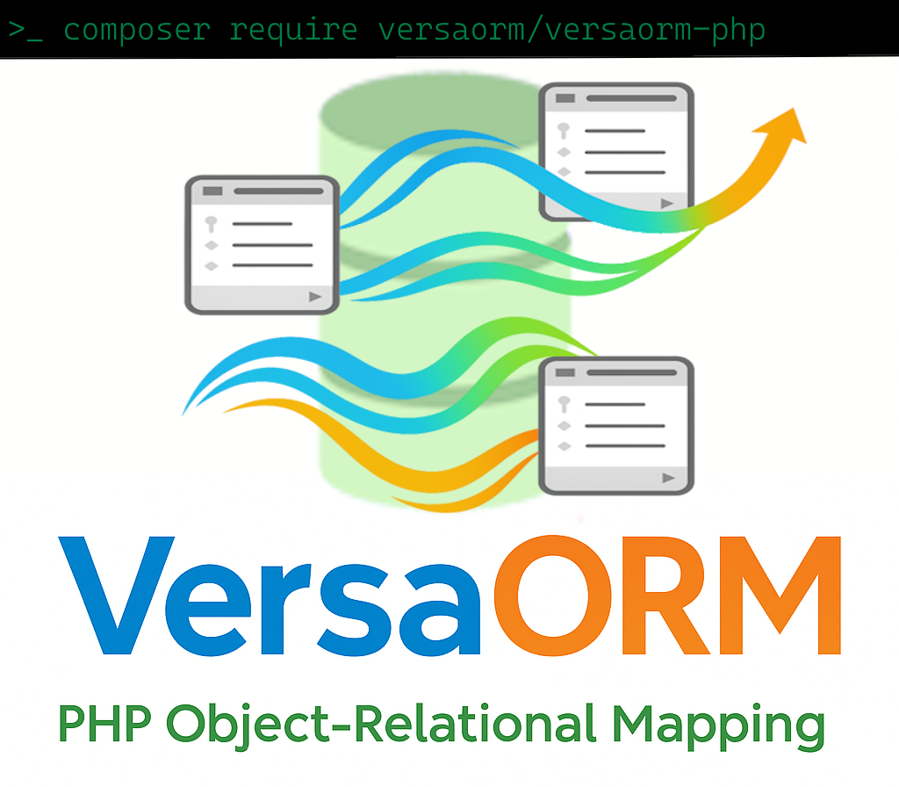

# 🚀 VersaORM-PHP

**ORM sencillo y seguro para PHP – minimiza SQL manual y acelera tu desarrollo.**

[](https://github.com/kriollo/versa-orm/actions/workflows/phpunit.yml)
[](https://codecov.io/gh/kriollo/versa-orm)
[](https://deepwiki.com/kriollo/versa-orm)
[](#)
[](#)
[](#)


- Última versión estable: 1.8.1
- Compatible con PHP 8.1+

# <p align="center"></p>

> VersaORM-PHP está construido sobre **PDO nativo** para máxima compatibilidad, simplicidad y rendimiento. No requiere compilación externa: solo PHP + tu base de datos.

## 📚 Documentación Completa

- 📖 **[Documentación Principal](docs/README.md)** - Guía completa desde básico hasta avanzado
- 🤖 **[Guía para IAs (llms.txt)](llms.txt)** - Mapa del repo y API clave para asistentes
- 🚀 **[Inicio Rápido](#-inicio-rápido)** - Empieza en 5 minutos
- ⚙️ **[Instalación](docs/02-instalacion/instalacion.md)** - Composer e instalación manual
- 🔧 **[CRUD Básico](docs/03-basico/crud-basico.md)** - Create, Read, Update, Delete
- 🔍 **[Query Builder](docs/04-query-builder/)** - Consultas fluidas y seguras
- 🔗 **[Relaciones](docs/05-relaciones/)** - hasMany, belongsTo, many-to-many
- 📖 **[Referencia SQL](docs/08-referencia-sql/)** - Equivalencias SQL ↔ VersaORM

### 🆕 Guías Especializadas (v1.4.1+)

- 🔧 **[Migración SchemaBuilder](docs/MigrationGuide_SchemaBuilder.md)** - De schemaCreate() al nuevo SchemaBuilder
- 🔗 **[Foreign Keys e Índices](docs/ForeignKeysAndIndexes_CompleteGuide.md)** - Guía completa con ejemplos prácticos

## 📋 ¿Qué es VersaORM?

VersaORM te permite interactuar con tu base de datos usando **objetos PHP** y un **Query Builder fluido**, apoyándose internamente en **PDO**. Así reduces errores, previenes inyecciones SQL y escribes código expresivo.

### 🤔 ¿Qué es un ORM?

Un **ORM** (Object-Relational Mapping) traduce tus objetos PHP a filas en la base de datos. En vez de escribir SQL como esto:

```sql
-- SQL tradicional (complicado y propenso a errores)
SELECT * FROM users WHERE status = 'active' AND age >= 18 ORDER BY created_at DESC;
INSERT INTO users (name, email, password) VALUES ('Juan', 'juan@email.com', 'hash...');
UPDATE users SET status = 'inactive' WHERE id = 1;
```

Con VersaORM escribes código PHP natural y seguro:

```php
// Con VersaORM (fácil y seguro)
$users = $orm->table('users')
    ->where('status', '=', 'active')
    ->where('age', '>=', 18)
    ->orderBy('created_at', 'desc')
    ->getAll();

$user = VersaModel::dispense('users');
$user->name = 'Juan';
$user->email = 'juan@email.com';
$user->password = password_hash('mi_password', PASSWORD_DEFAULT);
$user->store();

$user->status = 'inactive';
$user->store(); // Actualización automática
```

### 🏆 ¿Por qué elegir VersaORM?

| Necesidad            | Sin ORM (solo PDO)                           | Con VersaORM                               |
| -------------------- | -------------------------------------------- | ------------------------------------------ |
| Seguridad            | Debes escribir y parametrizar cada sentencia | Parámetros preparados automáticamente      |
| Mantenimiento        | SQL repetido en muchos archivos              | Lógica centralizada y fluida               |
| Curva de aprendizaje | Conocer bien SQL + PDO                       | API consistente (where, join, order, etc.) |
| Refactors            | Buscar/editar cadenas SQL                    | Cambias métodos encadenados                |
| Errores típicos      | Inyección, comas, orden de placeholders      | Minimizado por API tipada                  |

### 🌟 Características Principales

- ✅ **Construido sobre PDO** - Sin dependencias complicadas
- 🛡️ **Seguridad por defecto** - Prepared statements automáticos
- 🧩 **Modelos Active Record** - `dispense`, `load`, `store`, `trash`
- 🔍 **Query Builder fluido** - `where`, `join`, `groupBy`, `having`, `orderBy`, `limit`
- 🧠 **JOINs avanzados** - Condiciones encadenadas con `on()` y `onRaw()`
- 🔗 **Relaciones** - hasMany, belongsTo, many-to-many
- ⏰ **Timestamps automáticos** - `created_at` y `updated_at` con valores por defecto (Fix v1.4.1)
- 🏗️ **SchemaBuilder moderno** - API fluida para DDL con migración desde arrays
- 🔑 **Foreign Keys flexibles** - Sintaxis `foreign(['campo'])` y `foreign('campo')` validadas
- 💾 **Conversión de tipos** - Fechas, booleanos, JSON automático
- 🔀 **Operaciones de conjuntos** - UNION, INTERSECT, EXCEPT
- 🚫 **Cero compilación** - Solo PHP puro
- 📦 **Batch simple de modelos** - `VersaModel::storeAll([$m1,$m2])` devuelve array de IDs

## ✨ Arquitectura

```
┌──────────────────────────┐
│        Tu Código         │
│  (Modelos + Consultas)   │
└────────────┬────────────┘
             │ API PHP
┌────────────▼────────────┐
│       VersaORM-PHP       │
│ - VersaORM.php           │
│ - VersaModel.php         │
│ - QueryBuilder.php       │
└────────────┬────────────┘
             │ PDO
┌────────────▼────────────┐
│     Base de Datos        │
│ MySQL | PostgreSQL | SQLite │
└──────────────────────────┘
```

**Simple y directo**: Todo fluye a través de PDO sin procesos externos.

## 🛠️ Instalación

### Via Composer (Recomendado)

```bash
composer require versaorm/versaorm-php
```

### Instalación Manual

1. Descarga o clona el repositorio:
   ```bash
   git clone https://github.com/kriollo/versa-orm.git
   ```
2. Incluye los archivos necesarios:
   ```php
   require_once 'src/VersaORM.php';
   require_once 'src/VersaModel.php';
   require_once 'src/QueryBuilder.php';
   ```

### Requisitos del Sistema

- **PHP**: 8.1 o superior
- **Extensiones**: PDO, json, mbstring
- **Base de datos**: MySQL 5.7+, PostgreSQL 10+, o SQLite 3.6+
- **Sistema operativo**: Windows, Linux, macOS

**📖 Guía detallada**: [Instalación paso a paso](docs/02-instalacion/instalacion.md)

## ⚡ Inicio Rápido

### 1. Instalación

```bash
# Via Composer (recomendado)
composer require versaorm/versaorm-php

# O descarga manual desde GitHub
```

### 2. Configuración Básica

```php
use VersaORM\VersaORM;
use VersaORM\VersaModel;

// Configurar la conexión
$orm = new VersaORM([
    'driver' => 'mysql',
    'host' => 'localhost',
    'database' => 'mi_app',
    'username' => 'usuario',
    'password' => 'password',
    'charset' => 'utf8mb4'
]);

// Configurar modelos
VersaModel::setORM($orm);
```

### 3. Tu Primer Ejemplo

```php
// Crear un usuario
$user = VersaModel::dispense('users');
$user->name = 'Juan Pérez';
$user->email = 'juan@example.com';
$user->store(); // Se guarda automáticamente con timestamps

// Buscar usuarios activos
$activeUsers = $orm->table('users')
    ->where('status', '=', 'active')
    ->orderBy('created_at', 'desc')
    ->limit(10)
    ->getAll();

echo "Usuario creado con ID: " . $user->id;
echo "Usuarios activos encontrados: " . count($activeUsers);

// ✨ SchemaBuilder moderno (v1.4.1+)
use VersaORM\Schema\VersaSchema;

VersaSchema::create('documents', function ($table) {
    $table->id();
    $table->string('title');
    $table->timestamps(); // ✅ Valores automáticos funcionando

    // Foreign key con sintaxis flexible
    $table->foreign(['user_id'])->references('id')->on('users');
});
```

**¿Quieres más ejemplos?** → [Ver documentación completa](docs/README.md)

### 4. Ejemplos Comparativos (SQL vs VersaORM)

#### CRUD Básico - SQL vs VersaORM

```php
// ❌ SQL Manual (PDO) - Más código, más errores
$stmt = $pdo->prepare("INSERT INTO users (name,email) VALUES (?,?)");
$stmt->execute(['Juan Pérez','juan@example.com']);
$id = $pdo->lastInsertId();

$stmt = $pdo->prepare("SELECT * FROM users WHERE id = ?");
$stmt->execute([$id]);
$userData = $stmt->fetch(PDO::FETCH_ASSOC);

// ✅ VersaORM - Simple y seguro
$user = VersaModel::dispense('users');
$user->name  = 'Juan Pérez';
$user->email = 'juan@example.com';
$user->store(); // ID asignado automáticamente

// Leer, actualizar y eliminar
$user = VersaModel::load('users', $user->id);
$user->email = 'nuevo@example.com';
$user->store(); // Actualización automática
$user->trash(); // Eliminación segura
```

#### Query Builder - Consultas Fluidas y Seguras

```php
// ❌ SQL Manual - Propenso a errores de sintaxis
$sql = "SELECT * FROM users WHERE status = ? AND age >= ? AND role IN (?,?) ORDER BY created_at DESC LIMIT 10";
$stmt = $pdo->prepare($sql);
$stmt->execute(['active', 18, 'admin', 'editor']);
$users = $stmt->fetchAll(PDO::FETCH_ASSOC);

// ✅ VersaORM - Fluido y legible
$activeUsers = $orm->table('users')
    ->where('status', '=', 'active')
    ->where('age', '>=', 18)
    ->whereIn('role', ['admin', 'editor'])
    ->orderBy('created_at', 'desc')
    ->limit(10)
    ->getAll();

// Joins complejos simplificados
$userStats = $orm->table('users')
    ->select(['users.name', 'COUNT(posts.id) as total_posts'])
    ->leftJoin('posts', 'users.id', '=', 'posts.user_id')
    ->where('users.status', '=', 'active')
    ->groupBy(['users.id', 'users.name'])
    ->having('total_posts', '>', 5)
    ->getAll();

// Operaciones masivas seguras
$orm->table('products')
    ->whereIn('category_id', [1, 2, 3])
    ->where('stock', '>', 0)
    ->update(['status' => 'available']);
```

#### 🔗 Joins Compuestos (Nuevo patrón sencillo)

Necesitas unir por más de una columna? Usa el encadenado `join()->on()->on()` para mantenerlo claro:

```php
$rows = $orm->table('orders AS o')
    ->join('invoices AS i')
    ->on('o.id','=','i.order_id')
    ->on('o.company_id','=','i.company_id')
    ->where('i.status','=','paid')
    ->getAll();

// Con mezcla AND / OR
$sessions = $orm->table('sessions AS s')
    ->join('users AS u')
    ->on('s.user_id','=','u.id')
    ->on('s.admin_id','=','u.id','OR')
    ->getAll();
```

Regla simple: lo que define el emparejamiento va en `on()`, lo que filtra el resultado final va en `where()`.

#### Operaciones CRUD Avanzadas

```php
// UPSERT: Insertar si no existe, actualizar si existe
$result = $orm->table('products')->upsert(
    [
        'sku' => 'LAPTOP-001',
        'name' => 'MacBook Pro 16"',
        'price' => 2499.99,
        'stock' => 25
    ],
    ['sku'], // Claves únicas para detectar duplicados
    ['name', 'price', 'stock'] // Campos a actualizar si existe
);

// Método save() inteligente - detecta automáticamente INSERT vs UPDATE
$user = $orm->table('users')->save([
    'email' => 'john@example.com',
    'name' => 'John Updated',
    'role' => 'admin'
], ['email']); // Si existe el email, actualiza; si no, inserta

// insertOrUpdate() - alias intuitivo para upsert
$setting = $orm->table('settings')->insertOrUpdate([
    'key' => 'app_version',
    'value' => '2.1.0',
    'updated_at' => date('Y-m-d H:i:s')
], ['key']);

// replaceInto() - reemplazo completo (solo MySQL)
$backup = $orm->table('user_backups')->replaceInto([
    'user_id' => 123,
    'backup_data' => json_encode($userData),
    'created_at' => date('Y-m-d H:i:s')
]);
```

#### Modelos con Validación

```php
class User extends BaseModel {
    protected string $table = 'users';

    // Protección Mass Assignment
    protected array $fillable = ['name', 'email'];

    // Validación automática
    protected array $rules = [
        'name' => ['required', 'min:2'],
        'email' => ['required', 'email']
    ];
}

// Uso seguro con validación
try {
    $user = new User();
    $user->fill($_POST); // Solo campos $fillable
    $user->store(); // Validación automática
    echo "Usuario creado exitosamente";
} catch (VersaORMException $e) {
    echo "Error: " . $e->getMessage();
}
```


## 🔧 Configuración Rápida

### Configuración Básica
```php
use VersaORM\VersaORM;
use VersaORM\VersaModel;

$orm = new VersaORM([
    'driver' => 'mysql',        // mysql, postgresql, sqlite (alias aceptados: mariadb, pgsql, postgres)
    'host' => 'localhost',
    'database' => 'mi_app',
    'username' => 'usuario',
    'password' => 'password',
    'charset' => 'utf8mb4'
]);

VersaModel::setORM($orm);
````

### Configuraciones por Base de Datos

#### Drivers soportados y alias

VersaORM reconoce estos drivers principales:

- `mysql` (alias: `mariadb`)
- `postgresql` (alias: `pgsql`, `postgres`)
- `sqlite`

Se recomienda usar los nombres canónicos (`mysql`, `postgresql`, `sqlite`). Los alias se mantienen por compatibilidad.

**MySQL/MariaDB:**

```php
$config = [
    'driver' => 'mysql',
    'host' => 'localhost',
    'port' => 3306,
    'database' => 'mi_app',
    'username' => 'root',
    'password' => '',
    'charset' => 'utf8mb4'
];
```

**PostgreSQL:**

```php
$config = [
    'driver' => 'postgresql', // alias aceptados: pgsql, postgres
    'host' => 'localhost',
    'port' => 5432,
    'database' => 'mi_app',
    'username' => 'postgres',
    'password' => 'password'
];
```

**SQLite:**

```php
$config = [
    'driver' => 'sqlite',
    'database' => 'database/app.sqlite'
];
```

Nota sobre persistencia: `store()` siempre devuelve el ID (int|string) del registro insertado/actualizado. Puedes capturarlo:

```php
$id = $user->store(); // Inserta y devuelve ID
$user->name = 'Nuevo';
$sameId = $user->store(); // Devuelve el mismo ID tras update
```

**📖 Configuración detallada**: [Ver guía completa](docs/02-instalacion/configuracion.md)

## 📁 Estructura del Proyecto

```
versaORM-PHP/
├── src/                    # Código fuente VersaORM
│   ├── VersaORM.php       # Clase principal ORM
│   ├── VersaModel.php     # Modelos Active Record
│   ├── QueryBuilder.php   # Constructor de consultas
│   ├── Relations/         # Sistema de relaciones
│   ├── SQL/              # Generadores SQL específicos
│   └── Traits/           # Funcionalidades reutilizables
├── docs/                  # Documentación completa
│   ├── 01-introduccion/   # Conceptos básicos
│   ├── 02-instalacion/    # Guías de instalación
│   ├── 03-basico/         # CRUD y fundamentos
│   ├── 04-query-builder/  # Constructor de consultas
│   ├── 05-relaciones/     # Relaciones entre modelos
│   ├── 06-avanzado/       # Funcionalidades avanzadas
│   ├── 07-seguridad-tipado/ # Seguridad y validación
│   └── 08-referencia-sql/ # Equivalencias SQL
├── example/               # Aplicación de ejemplo
├── tests/                 # Suite de pruebas
├── composer.json         # Configuración Composer
└── README.md            # Esta documentación
```

## 🏆 Mejores Prácticas Demostradas

### 1. Usar Métodos ORM para Operaciones Básicas

```php
// ✅ CORRECTO - Usar métodos ORM
$task = VersaModel::dispense('tasks');
$task->title = 'Nueva tarea';
$task->store();

// ❌ INCORRECTO - SQL innecesario para operaciones simples
$orm->exec("INSERT INTO tasks (title) VALUES (?)", ['Nueva tarea']);
```

### 2. exec() Solo para Consultas Complejas

```php
// ✅ CORRECTO - Consulta compleja que necesita SQL
$stats = $orm->exec("SELECT COUNT(*) as total, AVG(rating) as avg_rating FROM tasks");

// ❌ INCORRECTO - Operación simple con SQL
$task = $orm->exec("SELECT * FROM tasks WHERE id = ?", [1])[0];
// MEJOR:
$task = VersaModel::load('tasks', 1);
```

### 3. Manejo de Errores Apropiado

```php
try {
    $task = VersaModel::dispense('tasks');
    $task->title = $title;
    $task->store();
    echo "✅ Tarea creada exitosamente";
} catch (VersaORMException $e) {
    echo "❌ Error: " . $e->getMessage();
}
```

### 4. 🔒 Modo Freeze para Protección de Esquema

```php
// ✅ PRODUCCIÓN - Activar freeze para proteger esquema
if (app()->environment('production')) {
    $orm->freeze(true);
    echo "🔒 Esquema protegido contra modificaciones DDL";
}

// ✅ DESARROLLO - Freeze selectivo por modelo
$orm->freezeModel(CriticalTable::class, true);

// ❌ BLOQUEADO - En modo freeze esto lanza excepción
try {
    $orm->exec("CREATE TABLE test (id INT)");
} catch (VersaORMException $e) {
    if ($e->getCode() === 'FREEZE_VIOLATION') {
        echo "Operación DDL bloqueada por seguridad";
    }
}
```

## 🚨 Troubleshooting

### Error de conexión a la base de datos

- Verifica las credenciales en la configuración
- Asegúrate de que el servidor de base de datos esté ejecutándose
- Confirma que la base de datos existe o que el usuario tiene permisos para crearla
- Revisa que las extensiones PDO necesarias estén instaladas

### Errores comunes

- **Class not found**: Verifica que el autoloader esté incluido correctamente
- **PDO extension not found**: Instala la extensión PDO para tu base de datos
- **Permission denied**: Verifica permisos de escritura para SQLite
- **Connection refused**: Confirma host y puerto de la base de datos

**📖 Guía completa de troubleshooting**: [Manejo de errores](docs/03-basico/manejo-errores.md)

## 📚 Documentación Detallada

### 🎯 Por Nivel de Experiencia

- **👶 Principiante**: [Introducción](docs/01-introduccion/) → [Instalación](docs/02-instalacion/) → [CRUD Básico](docs/03-basico/)
- **🏃 Intermedio**: [Query Builder](docs/04-query-builder/) → [Relaciones](docs/05-relaciones/) → [Avanzado](docs/06-avanzado/)
- **🚀 Experto**: [Seguridad](docs/07-seguridad-tipado/) → [Referencia SQL](docs/08-referencia-sql/)

### 📖 Por Tema

- **[🔧 CRUD y Modelos](docs/03-basico/)** - dispense, load, store, trash
- **[🔍 Query Builder](docs/04-query-builder/)** - Consultas fluidas y seguras
- **[🔗 Relaciones](docs/05-relaciones/)** - hasMany, belongsTo, many-to-many
- **[🚀 Funciones Avanzadas](docs/06-avanzado/)** - Batch, UPSERT, transacciones
- **[🔒 Seguridad](docs/07-seguridad-tipado/)** - Validación, freeze mode, tipado
- **[📖 Referencia SQL](docs/08-referencia-sql/)** - Equivalencias SQL ↔ VersaORM

### 🛠️ Para Desarrolladores

- **[🧪 Aplicación de Ejemplo](example/README.md)** - Demo completa funcional
- **[🏗️ Contribuir](CONTRIBUTING.md)** - Guía para contribuir al proyecto

## 🌟 Características Destacadas

### ⚡ Alto Rendimiento

- **PDO optimizado** con prepared statements reutilizables
- **API fluida** que reduce código repetitivo y errores
- **Query Builder eficiente** con generación SQL optimizada
- **Lazy loading** para relaciones bajo demanda

### 🛡️ Seguridad Robusta

- **Prepared statements automáticos** - Protección contra SQL injection
- **Mass Assignment protection** - Control con `$fillable` / `$guarded`
- **Validación declarativa** - Reglas por modelo automáticas
- **Freeze mode** - Bloquea cambios accidentales de esquema en producción

### 🚀 Desarrollo Ágil

- **Creación automática de campos** - Desarrollo rápido sin DDL manual
- **Detección inteligente de tipos** - Mapeo automático PHP ↔ SQL
- **Modo development** - Prototipado rápido sin esquemas previos
- **Transición suave** - De desarrollo (freeze OFF) a producción (freeze ON)

### 🔄 Máxima Compatibilidad

- **Múltiples bases de datos** - MySQL, PostgreSQL, SQLite
- **Framework agnostic** - Integra con cualquier proyecto PHP
- **Estándares PSR** - Sigue las mejores prácticas de PHP

## 🤝 Contribuir

¡Las contribuciones son bienvenidas! Por favor:

1. Fork el repositorio
2. Crea una rama para tu feature (`git checkout -b feature/nueva-funcionalidad`)
3. Commit tus cambios (`git commit -m 'Agregar nueva funcionalidad'`)
4. Push a la rama (`git push origin feature/nueva-funcionalidad`)
5. Abre un Pull Request

### Reportar Bugs

- Usa el [Issue Tracker](https://github.com/kriollo/versa-orm/issues)
- Incluye detalles del entorno (PHP version, OS, DB)
- Proporciona pasos para reproducir el problema

## 📄 Licencia

MIT License - ver archivo [LICENSE](LICENSE) para detalles.

## 💬 Soporte

- **Documentación**: [docs/](docs/)
- **Issues**: [GitHub Issues](https://github.com/kriollo/versa-orm/issues)
- **Discusiones**: [GitHub Discussions](https://github.com/kriollo/versa-orm/discussions)
- **Email**: jjara@websystem.cl

---

## �️ SQL vs VersaORM (Cheat Sheet Rápido)

| Objetivo        | SQL                                                               | VersaORM                                                                                                                  |
| --------------- | ----------------------------------------------------------------- | ------------------------------------------------------------------------------------------------------------------------- |
| Insert          | `INSERT INTO users (name) VALUES (?)`                             | `$u=VersaModel::dispense('users');$u->name='Ana';$u->store();`                                                            |
| Select por ID   | `SELECT * FROM users WHERE id=?`                                  | `$u=VersaModel::load('users',1);`                                                                                         |
| Filtro múltiple | `... WHERE status='a' AND age>=18`                                | `$orm->table('users')->where('status','=','a')->where('age','>=',18)->getAll();`                                          |
| Orden + Límite  | `ORDER BY created_at DESC LIMIT 10`                               | `->orderBy('created_at','desc')->limit(10)`                                                                               |
| Join simple     | `SELECT u.*,p.bio FROM users u JOIN profiles p ON p.user_id=u.id` | `$orm->table('users')->join('profiles','users.id','=','profiles.user_id')->select(['users.*','profiles.bio'])->getAll();` |
| Agregación      | `SELECT status,COUNT(*) c FROM users GROUP BY status`             | `$orm->table('users')->select(['status','COUNT(*) c'])->groupBy('status')->getAll();`                                     |
| Delete cond.    | `DELETE FROM sessions WHERE last_seen < ?`                        | `$orm->table('sessions')->where('last_seen','<',$cut)->delete();`                                                         |
| Update masivo   | `UPDATE products SET active=0 WHERE stock=0`                      | `$orm->table('products')->where('stock','=',0)->update(['active'=>0]);`                                                   |
| Upsert          | `INSERT ... ON DUPLICATE KEY UPDATE`                              | `$orm->table('cfg')->upsert($data,['key'],['value']);`                                                                    |

## 🧭 Roadmap

### 🎯 Próximas Funcionalidades

- **Generador de migraciones** - Sistema automático de migraciones
- **Seeders inteligentes** - Población de datos de desarrollo
- **Caché de consultas** - Sistema de caché configurable
- **Tipos avanzados** - UUID, Money, JSON helpers
- **Auditoría automática** - Campos created_by/updated_by automáticos
- **Eventos de modelo** - Hooks before/after save/delete
- **Validación avanzada** - Reglas personalizadas y condicionales

### 🔮 Visión a Largo Plazo

- **Performance optimizations** - Mejoras continuas de rendimiento
- **IDE integration** - Mejor soporte para autocompletado
- **Database-specific features** - Aprovechamiento de características únicas por BD

---

## 🎉 ¿Listo para empezar?

1. **[📖 Lee la introducción](docs/01-introduccion/)** - Entiende los conceptos básicos
2. **[⚙️ Instala VersaORM](docs/02-instalacion/)** - Configuración en 5 minutos
3. **[🔧 Prueba los ejemplos](docs/03-basico/)** - CRUD básico funcional
4. **[🚀 Explora funciones avanzadas](docs/)** - Documentación completa

---

🚀 **VersaORM-PHP** - _Simplicidad, Seguridad y Productividad para PHP_
